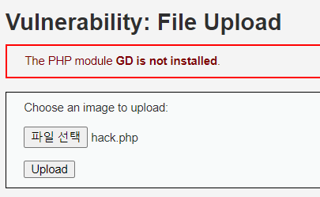

# Web hacking
Gotta install xmapp first to build the environment and run dvwa on the server.

맥북 또는 리눅스: http://coashanee5.blogspot.com/2018/07/kali-linux-dvwa-with-xampp.html

윈도우: https://m.blog.naver.com/PostView.nhn?blogId=sjhmc9695&logNo=221303220819&proxyReferer=https:%2F%2Fwww.google.com%2F

## SQL Injection
데이타 베이스로 날리는 sql문에 악의적인 값을 입력하여 의도한 sql문과 전혀 다른 결과를 받는 해킹방법. 아이디와 비밀번호를 확인하는 sql문에서 만약 `SELECT * FROM database WHERE id = 'id' AND password = 'password';` 라는 방식으로 아이디명과 비밀번호를 확인한다면('id'와 'password'가 유저의 입력값) 여기에 유저가 password 항목에 `hello' or 1=1 #` 같은 값을 넣으면 비록 hello가 비밀번호는 아니지만 `or 1=1`에 의해 true값이 반환이 되어 database에 있는 모든 유저의 정보를 리턴한다거나 아예 user 항목에 `admin #`같이 아예 뒤에 비밀번호를 확인하는 부분을 주석처리해 비밀번호 없이도 admin으로 로그인을 하는등 개발자의 의도와 전혀 다른 방식으로 우회해서 해킹하는 방법이다. 

### level low: 

위에 보이는 창은 유저 번호를 입력하면 유저의 이름을 알려주는 기능을 한다. 하지만 `1' or 1=1`을 입력하면 유저의 번호와 상관없이 `or 1=1`에 의해 모든 유저의 정보가 출력된다. 

### level medium: 

이번에는 입력할 수 있는 창 자체가 없다. 이 같은 경우는 개발자 모드로 들어가서 값을 조작한다. (위도우 같은 경우는 F12 키를 누르면 된다.) 그렇다면 2번째 사진처럼 값을 조작할 수 있는 창이 뜬다 여기서 실제 값과 선택할 수 있는 값 등을 다 바꿀 수 있는데 여기서 직전 문제에서 입력했던 `1 or 1=1`를 입력해 모든 유저의 정보를 출력할 수 있다. 

### level high:

level high 의 경우는 따로 창이 뜨는데 여기서 똑같이 `1' or 1=1#`을 입력하면 된다. 

## XSS Stored Cross Site Scripting
XSS공격 같은 경우는 입력창 (계시물 입력창 등)에 javascript를 집어 넣어서 해킹을 하는 방법이다. 여기서는 alert()를 넣어서 작동하는 여부만 확인하지만 실제로는 타유저의 세션정보 등을 빼돌리는 코드를 주입해 해킹을 진행한다. 이렇게 주입된 javascrip 코드는 계시판에 올라가 특정 페이지에 접속을 하기만하면 작동할 수 있게 함정을 파놓는 방식으로 진행이 된다.

### level low: 

위에 보이는 것처럼 메시지 입력창에 스트립트를 저렇게 넣으면 페이지에 스크립드가 들어가고 실제 메세지는 없는걸로 인식을 한다. 그리고 다시 계시판에 들어갈려고 하면 두번째 사진처럼 alert가 작동하는 것으로 확인된다. 

## Command Injection
command injection같은 경우는 command를 실행하는 창에 다른 command를 넣어서 해킹하는 방식으로 진행이 된다. `&&`로 앞에 명령어도 실행시키고 뒤에 명령어도 실행해라 하는 방식이나 `||`로 만약 앞에 커맨드가 실행이 안되면 뒤에 커맨드를 실행해라 등의 특수 부호를 통해서 진행이 된다. 

### level low:

`127.0.0.1 && dir`로 아무 아이피주소를 입력해 핑을 확인하고 dir명령어를 통해 디랙토리의 구조를 출력하도록한다. 

### level medium:

level medium은 `&&`을 확인하고 없애기 때문에 `||`으로 뒤에 `dir`를 실행시킨다. 

### level high:

level high는 `||`까지 확인한다. 다만 `(` `)`같은 부호도 확인해 없애주기 떄문에 `||`를 중간에 `(` 로 나누어 `||`를 감지못하게 하고 중간에 괄호를 없애는 방식으로 `||`를 만들어 커맨드를 실행시킬 수 있다. 만약 없애는 것이 아닌 빈 공간으로 바꾸는 방식으로 처리를 했다면 이 방법은 안먹힐 것이다. 

## File Vulnerability
파일을 통한 해킹은 악의의 파일을 만들어 업로드하고 파일 위치를 알아낸 뒤 그 파일을 실행시키는 방식으로 진행이 된다. 이 해킹 방법은 파일의 위치를 알아내서 실행시켜야 하기 때문에 보통 command injection과 같이 사용된다. 

### level low:

hack.php라는 파일을 만들고 파일에는 `dir`를 실행하는 코드가 심어져 있다. 이를 업로드 한다. 그리곤 여기서 파일의 위치를 알려준다. 이 위치의 링크로 가보면 `dir`이 실행이 되어 결과화면을 출력하는 것을 확인할 수 있다.
>다른 뒙사이트를 해킹할 떄는 당연히 이런 파일의 위치를 알려주지 않을 것이다. 그렇기에 command injection을 통해서 파일이 업로드되는 디렉토리를 알아내야 한다. 

### level medium:

여기에서는 이미지 파일만 받는다. 따라서 php파일로 작성한 코드의 확장자명만 .PNG로 변경시켜준 뒤 업로드한다. 그 뒤론 확장자명을 변경시켜주는 작업을 거치면 된다. 이 또한 command injection으로 진행한다. 위도우 같은 경우는 `ren`으로 이름을 바꾼다. 확장자명을 바꾼 뒤 그 위치로 접속을 해보면 실행이 되는 것을 확인할 수 있다. 
